Title: Image Interpolation with Diffusion Models
Subtitle: Reproducing a training-free diffusion interpolation pipeline
Year: 2026
Tags: Diffusion, Research, Reproduction
Thumbnail: thumbnail.mp4
Cover: cover.png

## Overview

Image interpolation with diffusion models has rapidly evolved from simple latent blending to structured, geometry- and probability-aware path generation. Early work such as *Interpolating between Images with Diffusion Models* [\[1\]](https://arxiv.org/abs/2307.12560) introduced a training-free pipeline that combines latent, noise, and text interpolation, but suffers from semantic instability and artifacts. Subsequent methods improve interpolation quality by introducing additional structure: *DiffMorpher* [\[2\]](https://arxiv.org/abs/2312.07409) interpolates LoRA parameters, noise, and attention features to achieve smoother and more consistent morphing, at the cost of per-image optimization; *DreamMover* [\[3\]](https://arxiv.org/abs/2409.09605) extends interpolation to large-motion scenarios by incorporating diffusion priors with flow estimation and attention fusion; and attention-based approaches such as *AID: Attention Interpolation of Text-to-Image Diffusion* [\[4\]](https://arxiv.org/abs/2403.17924) improve controllability in conditional generation. More recent work, *Probability Density Geodesics in Image Diffusion Latent Space* [\[5\]](https://arxiv.org/abs/2504.06675), reframes interpolation as finding paths along high-probability regions of the diffusion latent space, addressing the fundamental issue that linear interpolation often traverses unrealistic low-density regions.

Overall, existing methods can be categorized into latent-space interpolation, noise/trajectory interpolation, parameter (e.g., LoRA)-space interpolation, and attention-based interpolation, each offering different trade-offs in smoothness, semantic consistency, controllability, and computational cost.

Despite significant progress, key challenges remain, including degeneration, hallucination, identity drift, and the lack of reliable evaluation metrics, motivating future research toward geometry-aware, flow-based, and unified interpolation frameworks.

In this project, we reproduce *Interpolating between Images with Diffusion Models* [\[1\]](https://arxiv.org/abs/2307.12560), implementing the core interpolation pipeline with modified conditioning strategies and analyzing the method's capabilities and constraints.

## Problem Formulation

Given two input images $x_0$ and $x_1$, the goal of image interpolation is to generate a sequence of intermediate images $\{x_\alpha\}_{\alpha \in [0,1]}$ such that:

- $x_{\alpha=0} = x_0$ and $x_{\alpha=1} = x_1$,
- the transition is smooth with respect to $\alpha$,
- intermediate images remain realistic and semantically consistent.

In diffusion-based methods, this is typically achieved by mapping images into a latent space and defining an interpolation path:

$$z_\alpha = (1 - \alpha)\, z_0 + \alpha\, z_1,$$

where $z_0$ and $z_1$ are latent representations of $x_0$ and $x_1$. The interpolated latent $z_\alpha$ is then decoded through the diffusion model to obtain $x_\alpha$.

## Method

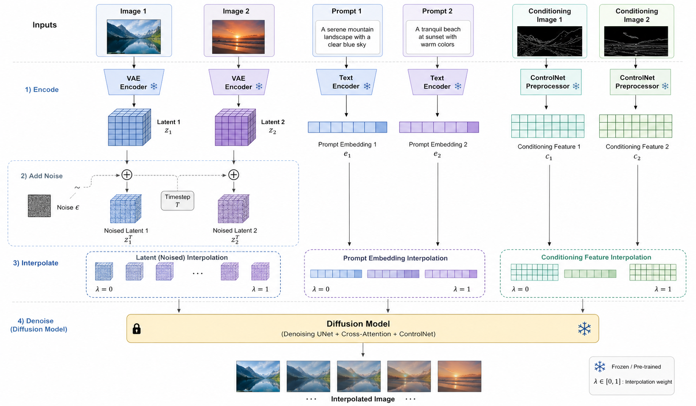

### Iterative Interpolation

Given $N$ interpolation steps, we take two input images denoted as $I_0$ and $I_N$. In the first step, we interpolate between $I_0$ and $I_N$ to generate the midpoint $I_{N/2}$. Next, we recursively interpolate between consecutive pairs: $I_0$ and $I_{N/2}$ yield $I_{N/4}$, while $I_{N/2}$ and $I_N$ yield $I_{3N/4}$. This process continues iteratively until we obtain the complete sequence $I_0, I_1, \ldots, I_N$. At each step, we generate multiple candidate frames and select the best one either manually or via CLIP scoring [\[8\]](https://arxiv.org/abs/2103.00020).

### Interpolation Mechanics

As shown in the pipeline figure above, our approach feeds three interpolated components into Stable Diffusion 1.5 [\[6\]](https://arxiv.org/abs/2112.10752)[\[7\]](https://github.com/CompVis/stable-diffusion). We first encode both input images through the VAE encoder to obtain latent representations $z_1$ and $z_2$, then add identical noise to both. The noise level $t$ is adaptive: frames closer to the endpoints use smaller $t$ values to minimize variation. We interpolate the noised latent tensors linearly to obtain the intermediate latent representation.

For text conditioning, we explore two approaches: (1) optimizing a single prompt embedding via textual inversion to minimize the loss $\mathcal{L}(c_{\text{prompt}}) = \| \epsilon_\theta(z_t, c_{\text{prompt}}) - \epsilon \|^2$, where $z_t$ denotes the noised latent and $\epsilon$ is the ground-truth noise; (2) directly providing two manual prompts describing each image, then interpolating their CLIP embeddings.

For spatial conditioning, we extract either edge maps or pose keypoints using a ControlNet auxiliary detector. For non-photorealistic images, we first apply image-to-image translation with a photorealistic style guidance prompt before extracting control features. These conditioning features are then linearly interpolated between the two inputs.

## Results & Analysis

We conduct experiments on an A100 GPU using 200 DDIM steps for improved quality. Generating a complete 32-frame interpolation sequence requires approximately 30 minutes.

When input images have similar structural layouts (i.e., similar edge maps), the method generates plausible transitions, as shown below.

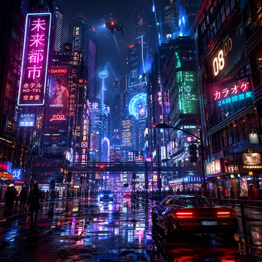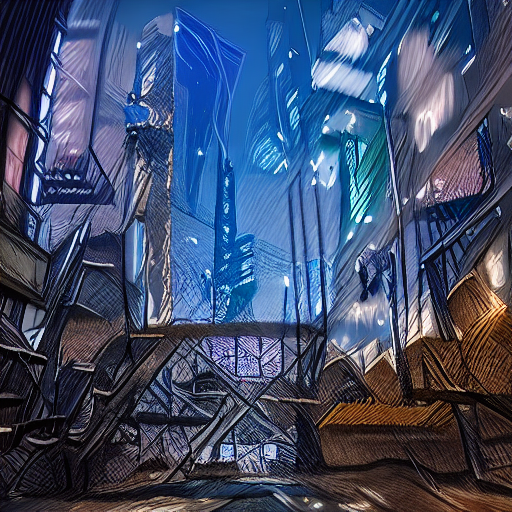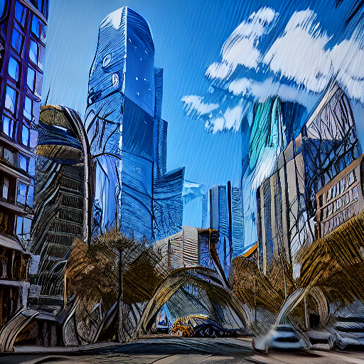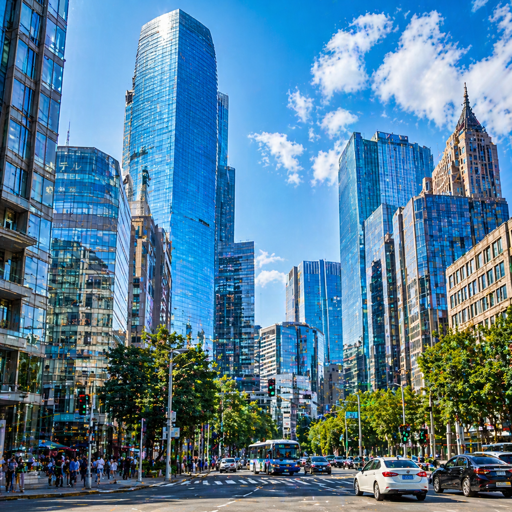

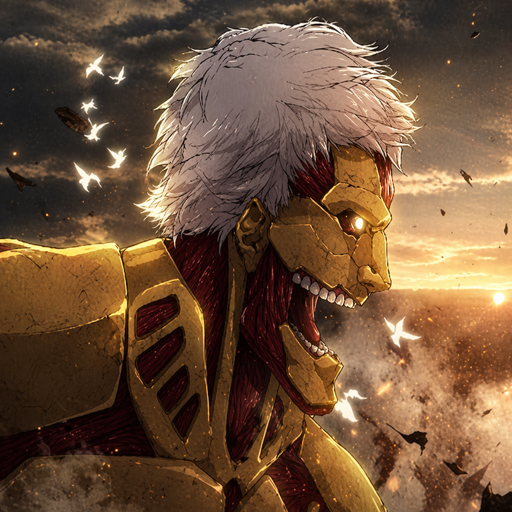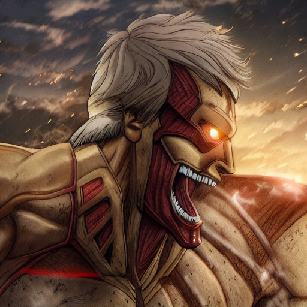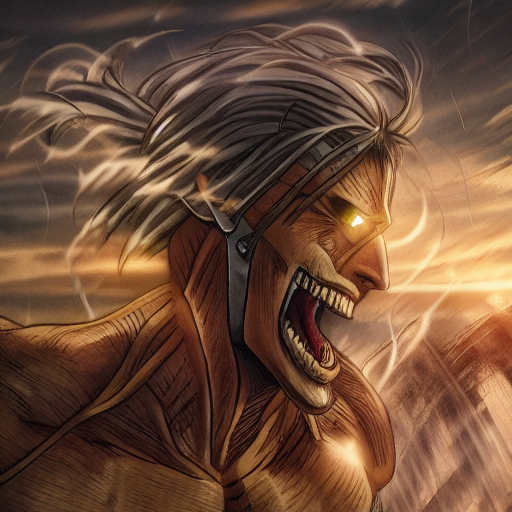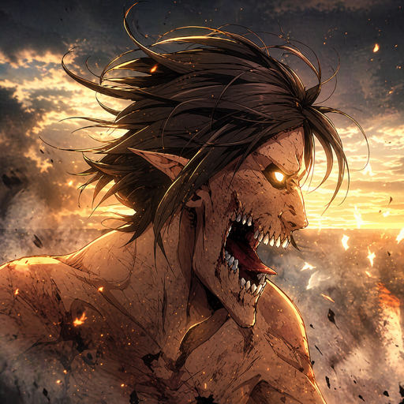

However, the results exhibit high sensitivity to spatial conditioning. Without ControlNet guidance, interpolated frames become unstable. When using edge conditioning — the most common configuration — the interpolated edge maps contain overlapping edges from both inputs, and these overlapping regions produce visual artifacts in the generated frames. For image pairs with large semantic, stylistic, or structural gaps (e.g., photorealistic to anime, vastly different edge maps), the method struggles to produce smooth transitions.

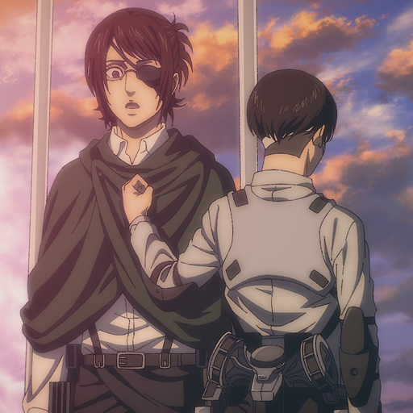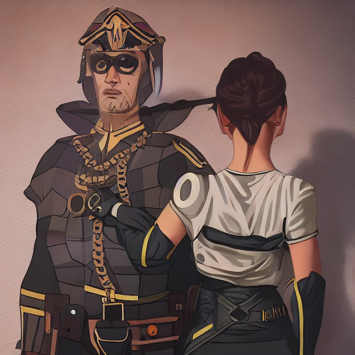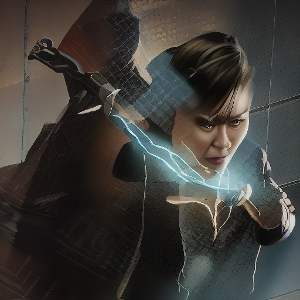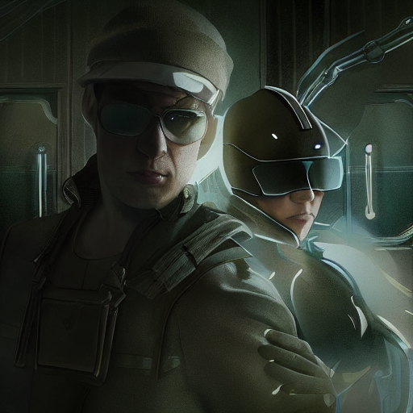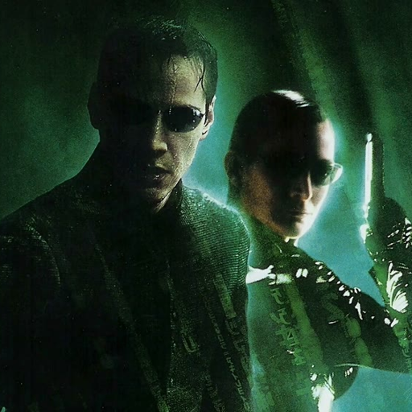

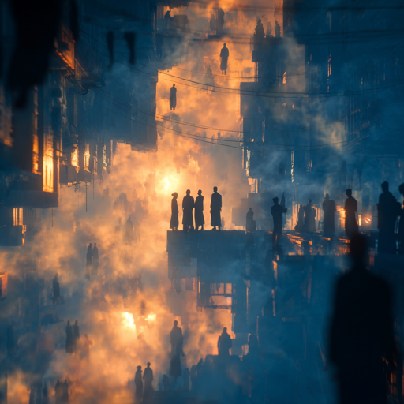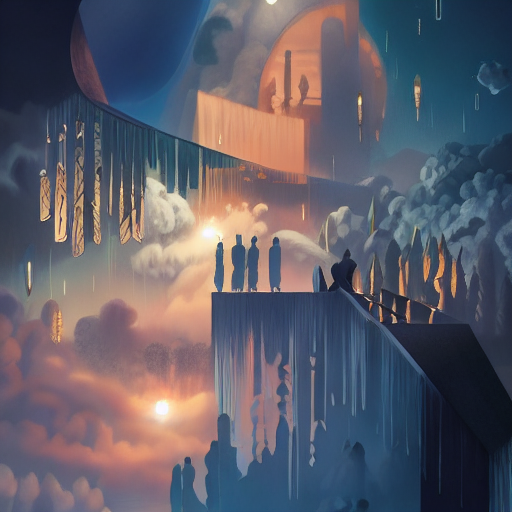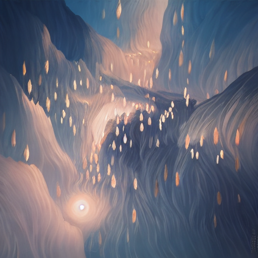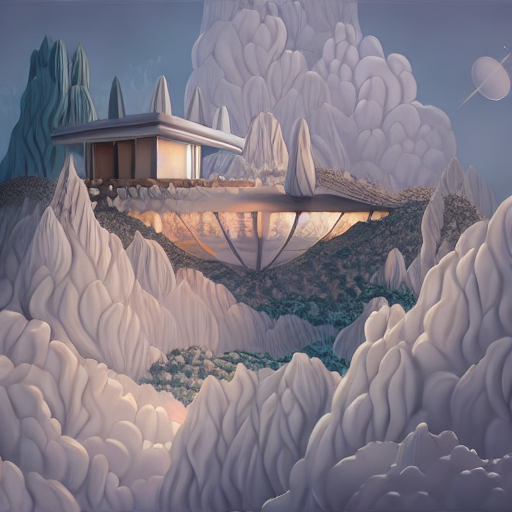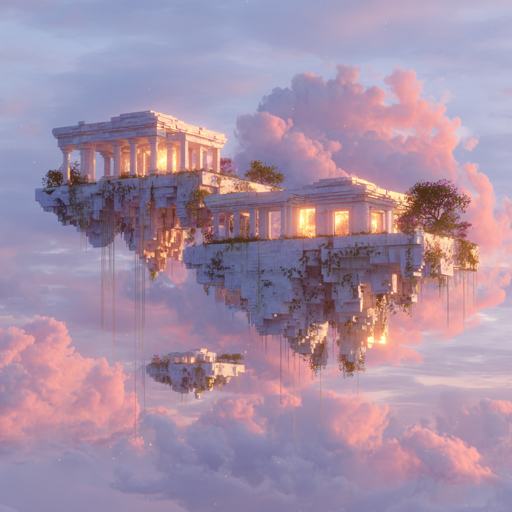

Regarding textual inversion, we observe that the loss fluctuates periodically without converging, even when increasing optimization steps from 200 to 1000. When images differ semantically, the shared initial prompt often poorly describes one input. To address this, we experimented with providing two distinct prompts describing each image separately. This approach yields comparable performance with improved stability.

## Future Work

Future work could extend this analysis with quantitative evaluation metrics to complement our qualitative observations.

Additionally, it would be interesting to explore whether a systematic taxonomy of image transitions might reveal distinct interpolation behaviors. Such a taxonomy could categorize transitions by their dominant characteristics — temporal continuity (video-like sequences), stylistic shifts (photorealistic to artistic), semantic changes (cross-category transformations), structural variations (pose and layout), and identity transitions (same category, different instances). If each transition type exhibits specific features or failure patterns, this could provide insights into the fundamental characteristics of diffusion-based interpolation and potentially inform the development of specialized or adaptive approaches for different scenarios.

## References

1. T. Wang and P. Golland. *Interpolating between Images with Diffusion Models.* ICML Workshop, 2023. <https://arxiv.org/abs/2307.12560>
2. K. Zhang et al. *DiffMorpher: Unleashing the Capability of Diffusion Models for Image Morphing.* CVPR, 2024. <https://arxiv.org/abs/2312.07409>
3. J. Xing et al. *DreamMover: Leveraging the Prior of Diffusion Models for Image Interpolation with Large Motion.* ECCV, 2024. <https://arxiv.org/abs/2409.09605>
4. X. Li et al. *AID: Attention Interpolation of Text-to-Image Diffusion.* NeurIPS, 2024. <https://arxiv.org/abs/2403.17924>
5. Y. Chen et al. *Probability Density Geodesics in Image Diffusion Latent Space.* CVPR, 2025. <https://arxiv.org/abs/2504.06675>
6. R. Rombach, A. Blattmann, D. Lorenz, P. Esser, and B. Ommer. *High-Resolution Image Synthesis with Latent Diffusion Models.* CVPR, 2022. <https://arxiv.org/abs/2112.10752>
7. Stability AI. *Stable Diffusion v1.5.* 2022. <https://github.com/CompVis/stable-diffusion>
8. A. Radford et al. *Learning Transferable Visual Models From Natural Language Supervision.* ICML, 2021. <https://arxiv.org/abs/2103.00020>
