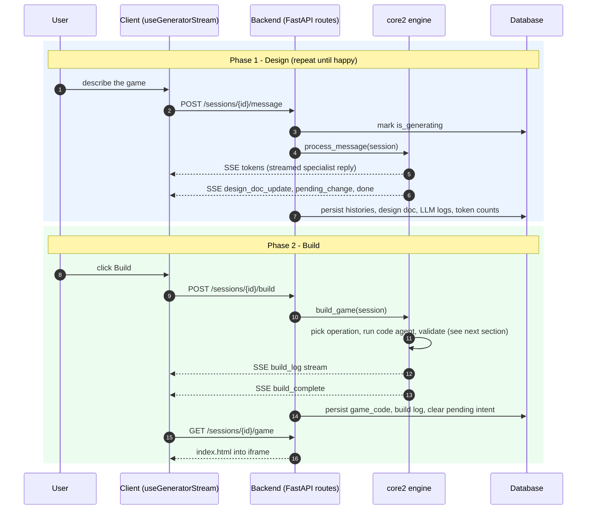
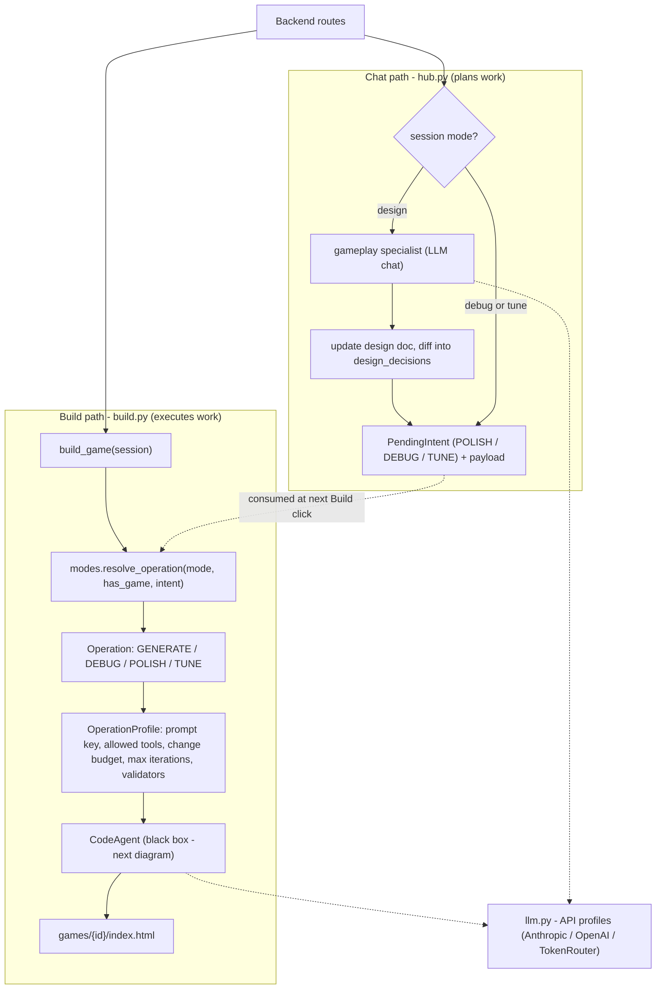
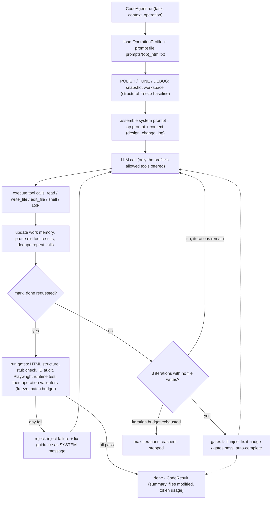

Title: Clay
Subtitle: Shape ideas into playable games through conversation — no engine required
Year: 2026
Tags: Agents
Thumbnail: thumbnail.mp4
Cover: cover.png

## Overview

This is a web app that helps non-technical game enthusiasts build web games without learning a complex game engine.

Users start by brainstorming with a gameplay design agent that guides them using game design principles and generates a game blueprint. They can edit the blueprint at any time, then click Build to generate a playable HTML game. After testing it, they can switch between **Debug** mode to fix issues, **Polish** mode to refine the game's feel, or **Design** mode to add new mechanics and continue iterating.

## System Architecture

| Module | Responsibility | Boundary | Tech Stack |
|---|---|---|---|
| **Frontend** (`client/`) | Presentation and interaction: chat UI, mode switching (design/debug/tune), design-doc editor, build progress, game iframe. Holds only *view* state. | Talks to the backend exclusively over HTTP/SSE (`/api/*`); rehydrates from `/sessions/{id}/state` on load, so a refresh mid-generation is recoverable. Never touches the DB or LLMs directly. | React 19, TypeScript, Vite, `ReadableStream` SSE parsing |
| **Backend** (`backend/`) | HTTP/SSE boundary and persistence coordinator: owns sessions, users, and games as resources; wraps core2's async generators in SSE frames; persists state, token usage, and audit logs after each stream. Almost no domain logic. | Sits between client and engine: validates requests, delegates to core2 via direct import (same process), writes to the DB. Only layer that touches persistence. | FastAPI, Pydantic, SQLAlchemy (async) + Alembic, uvicorn |
| **Generation engine** (`core2/`) | All AI behavior: specialist chat (design-doc authoring), mode→operation policy, and the tool-calling code agent that writes the game HTML and validates it. | Imported directly by the backend — no network hop. Knows nothing about HTTP or the database; its contract is "async generators that yield typed events," and its only I/O is the game workspace on disk and LLM APIs. | Python, per-operation `OperationProfile`s, Playwright (Chromium) validation gate |
| **Database** | Durable shadow of in-memory session state: users, sessions, design docs, built `game_code`, build logs, LLM-call logs, token counters. | Accessed only through `backend/db/crud.py`; core2 and the client never see it. Rehydrates all sessions on startup. | SQLite (local) / Neon Postgres (prod), asyncpg, Alembic migrations |
| **External services** | LLM inference for specialists and the code agent. | Reached only from `core2/llm.py` via API profiles (auto-selected by which key is set, overridable per session). | Anthropic / OpenAI / TokenRouter APIs |

### Creating Workflow

## Agent Architecture

### Inside the Code Agent

## Challenges & Findings

### The AI-native game engine hypothesis didn't hold

My initial hypothesis was that the LLM era would enable an entirely new abstraction for game engines.

Instead of organizing games around low-level runtime concepts such as GameObjects, Components, Scenes, and Assets—abstractions designed for experienced developers—I expected the primary abstractions to shift toward higher-level semantic concepts that anyone could understand intuitively.

- Gameplay (game loops, rewards, progression, uncertainty)
- Visual (art direction, VFX descriptions, image semantics)
- Audio
- Narrative

The assumption was that if game creators could describe games in these concepts, an AI-native engine could translate them into implementation details.

However, building the product gradually challenged this hypothesis.

No matter how the game is described, it still has to be represented as GameObjects—the fundamental abstraction for entities in the game world—with gameplay scripts, visual assets, animations, audio, and other engine-level data attached to them. The semantic layer can change how these objects are authored, but it cannot fundamentally change how they are represented inside the engine.

In practice, my architecture naturally converged back toward the structure of existing engines.

Rather than inventing a fundamentally new engine, I was effectively building another abstraction layer on top of Unity or Unreal—something closer to an AI-powered editor or MCP layer than a replacement for the engine itself.

That realization significantly weakened the original technical thesis.

### User behavior didn't match my expectations

I expected users with creative game ideas to value a structured game design workflow.

Instead, I observed almost the opposite. Users rarely thought about games in a structured way. Rather than specifying mechanics, progression, reward systems, or player experience, they tended to write open-ended prompts and expected the AI to make all the design decisions.

As a result, most users preferred rapidly generating many small games instead of iterating on a single high-quality one. The majority of creations were variations of existing mechanics with lower production quality rather than original designs.

### The economics didn't scale

The generation pipeline was significantly more expensive than expected.

Even a simple browser game typically required around 1,000 lines of code, excluding additional iterations, agent reasoning, debugging, and image generation. In practice, the total token consumption was much higher than the final source code alone would suggest.

At the same time, games within the same genre share a large amount of common architecture. Platformers, puzzle games, tower defense games, and card games all reuse similar gameplay systems and code patterns.

Generating every project entirely from scratch ignores this redundancy.

This imbalance became even more apparent when considering the output quality. Most generated games were low-effort variations of existing mechanics and created little lasting value, making the generation cost difficult to justify.

### Investors' perspective

Conversations with investors revealed a different set of concerns that were less about technology and more about product strategy.

The first question was the target user. Was the product intended for UGC creators, aspiring indie developers, professional studios, or someone else? The positioning remained ambiguous.

If the target was professional creators, another question naturally followed: why would they switch from their existing workflow? Today's pipelines already combine mature game engines with increasingly capable AI tools. A new product would need to offer a compelling advantage over these established workflows, especially if the quality of the generated games was not yet competitive.

Unlike images or short videos, a game's value comes almost entirely from whether it is enjoyable to play. Creating playable software has a much higher production cost than generating passive media, while consuming games also requires significantly more time and commitment.

As a result, the growth dynamics that worked for short-form video platforms are unlikely to transfer directly to AI-generated games. Producing a large volume of games does not automatically create value if the games themselves are not engaging.